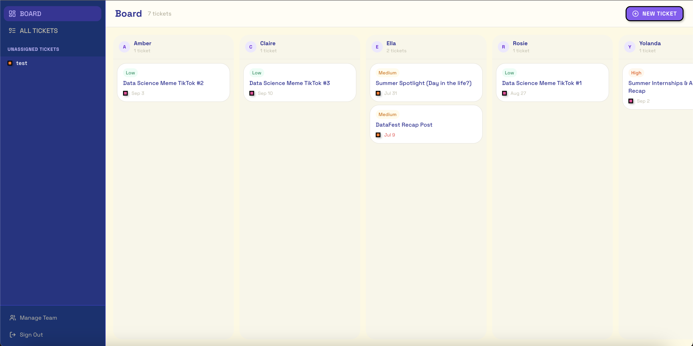
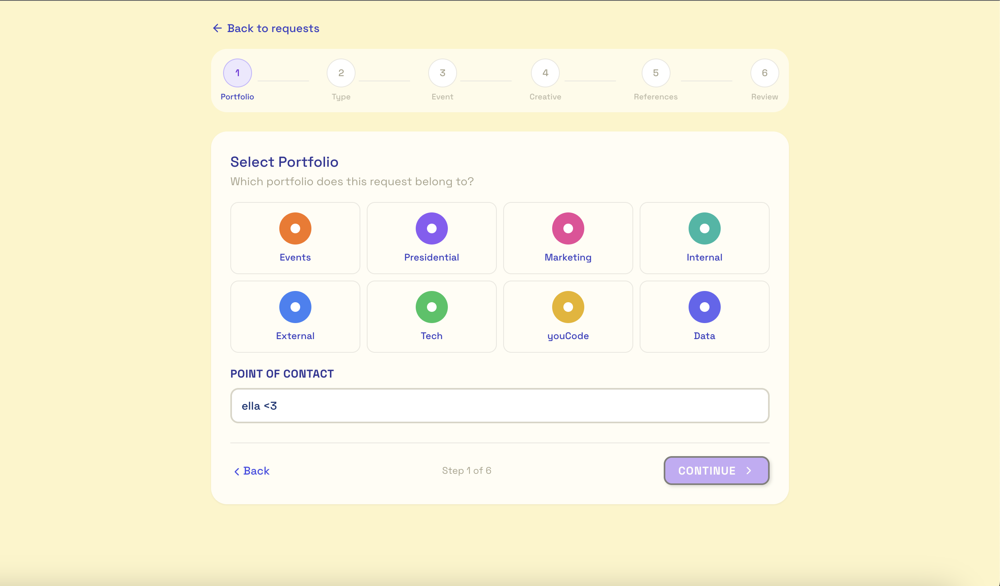
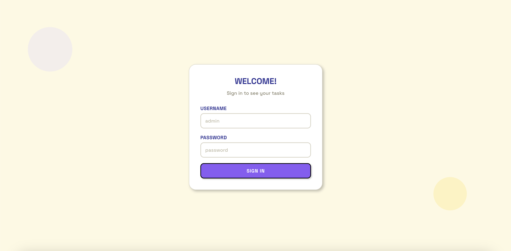
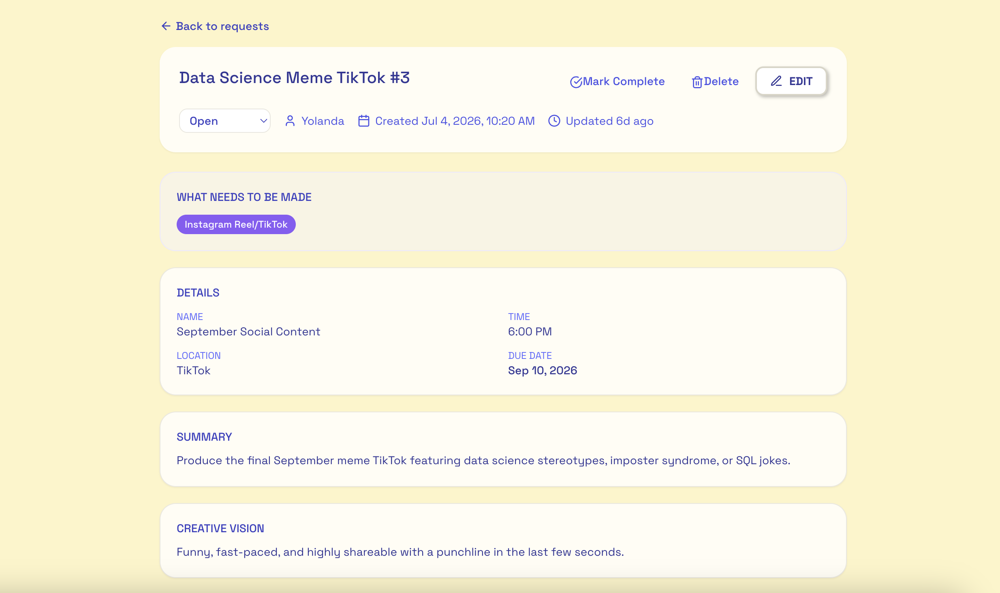
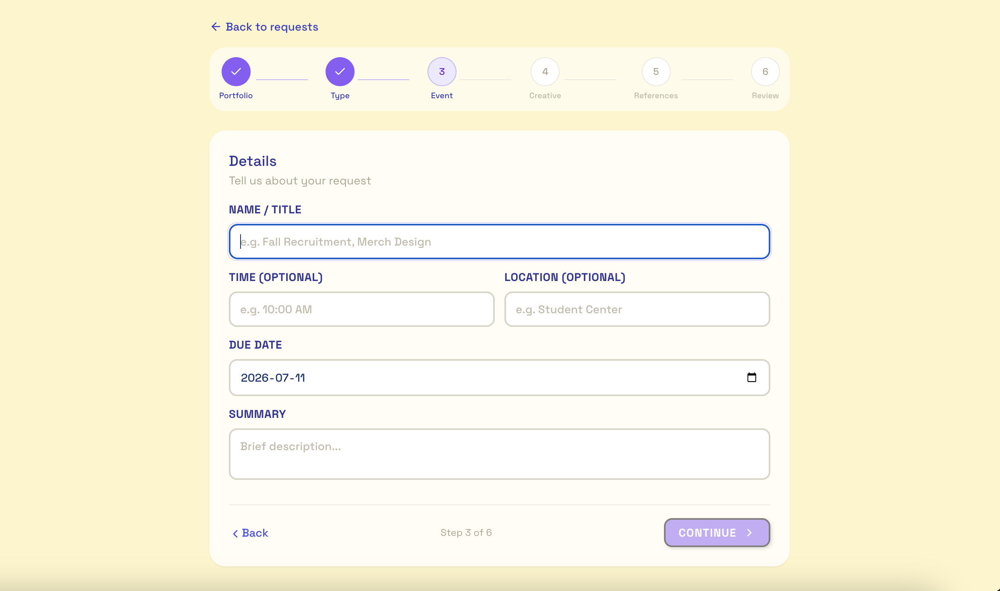
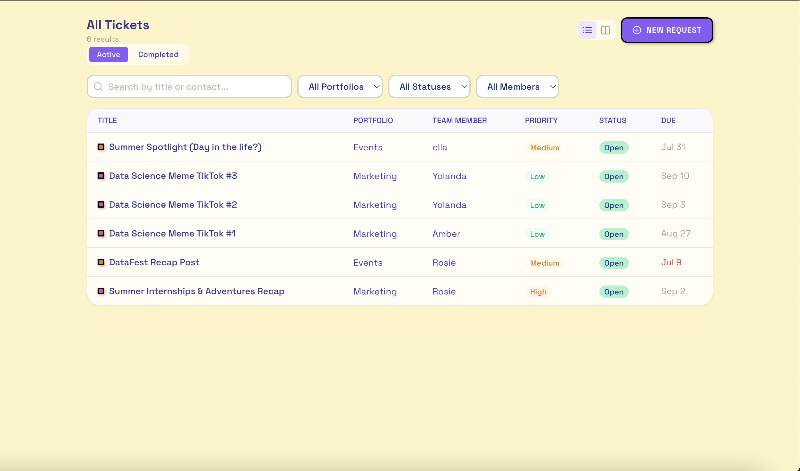

# Portfolio Manager (PM)

A Next.js web application for managing design and marketing requests across multiple portfolios in a team environment.



## Table of Contents

- [Overview](#overview)
- [Features](#features)
- [Screenshots](#screenshots)
- [Tech Stack](#tech-stack)
- [Getting Started](#getting-started)
- [Database Schema](#database-schema)
- [Project Structure](#project-structure)
- [Usage](#usage)
- [Available Scripts](#available-scripts)
- [Development](#development)
- [Security](#security)
- [Contributing](#contributing)
- [License](#license)
- [Resources](#resources)

## Overview

PM is a portfolio management system designed to streamline the creation and tracking of design requests. It helps teams organize work by portfolio, assign priorities, and track progress from creation to completion.

## Features

- **Dashboard** — View portfolio-wide statistics including total requests, open items, in-progress work, and urgent priorities
- **Request Management** — Create, view, and track design requests with comprehensive details
- **Portfolio Organization** — Categorize requests by portfolio (Events, Presidential, Marketing, Internal, External, Tech, youCode, Data)
- **Team Collaboration** — Assign points of contact and collaborators to requests
- **Priority Tracking** — Mark requests as Low, Medium, High, or Urgent priority
- **Status Workflow** — Track requests through statuses: Open, In Progress, In Review, Completed, Archived
- **Graphic Type Selection** — Specify request types including Instagram content, LinkedIn posts, certificates, and more
- **Dark Mode UI** — Modern interface built with Tailwind CSS

## Screenshots

| Dashboard | Request Detail |
|---|---|
|  |  |

| Login Page | Request Form |
|---|---|
|  |  |

| Request Detail | Requests List |
|---|---|
|  |  |


## Tech Stack

| Layer | Technology |
|---|---|
| Framework | Next.js 14 with React 18 |
| Language | TypeScript |
| Styling | Tailwind CSS with shadcn/ui components |
| Backend | Supabase (PostgreSQL database) |
| Icons | Lucide React |
| Date Handling | date-fns |

## Getting Started

### Prerequisites

- Node.js 18+ installed
- A Supabase account (free tier works)

### Installation

1. Clone the repository:
   ```bash
   git clone https://github.com/ellailan/pm.git
   cd pm
   ```

2. Install dependencies:
   ```bash
   npm install
   ```

3. Set up Supabase:
   - Follow the detailed guide in [SUPABASE_SETUP.md](./SUPABASE_SETUP.md)
   - Create a new Supabase project
   - Configure environment variables (see below)
   - Run the database schema

4. Configure environment variables:
   ```bash
   cp .env.local.example .env.local
   ```

   Edit `.env.local` and add your credentials:
   ```env
   # Supabase
   NEXT_PUBLIC_SUPABASE_URL=your-project-url
   NEXT_PUBLIC_SUPABASE_ANON_KEY=your-anon-key
   
   # Authentication (optional but recommended)
   AUTH_USER=admin
   AUTH_PASS=password
   ```

5. Run the development server:
   ```bash
   npm run dev
   ```

6. Open [http://localhost:3000](http://localhost:3000) in your browser.

## Database Schema

The application uses two main tables:

### Tickets
- Request details (title, summary, creative vision)
- Portfolio and team assignments
- Graphic type specifications
- Event information (name, time, location)
- Status and priority tracking
- Timestamps and audit trail

### Team Members
- Member ID and name
- Used for point of contact and collaborator assignments

## Project Structure

```
pm/
├── src/
│   ├── app/                    # Next.js app router pages
│   │   ├── (protected)/        # Authenticated routes
│   │   │   ├── requests/       # Request management pages
│   │   │   └── layout.tsx      # Protected layout with sidebar
│   │   ├── login/              # Login page
│   │   └── layout.tsx          # Root layout
│   ├── components/
│   │   ├── layout/             # Sidebar, topbar, dialogs
│   │   ├── ui/                 # Reusable UI components
│   │   └── tickets/            # Ticket-related components
│   ├── lib/
│   │   ├── supabase/           # Supabase client and schema
│   │   ├── ticket-context.tsx  # Ticket state management
│   │   └── team-context.tsx    # Team state management
│   └── types/                  # TypeScript type definitions
├── scripts/
│   └── seed-supabase.mjs       # Database seeding script
├── docs/
│   └── screenshots/            # README screenshots
└── SUPABASE_SETUP.md           # Detailed setup guide
```

## Usage

### Creating a Request

1. Navigate to "New Request" from the sidebar
2. Fill in the request form with:
   - Portfolio selection
   - Point of contact
   - Graphic type(s) needed
   - Event details (if applicable)
   - Summary and creative vision
   - Deadline
   - Additional requests/notes
3. Submit the form

### Managing Requests

- View all requests on the Requests page
- Click on a request to view details
- Update status and priority
- Add collaborators
- Archive completed work

## Available Scripts

| Command | Description |
|---|---|
| `npm run dev` | Start development server |
| `npm run build` | Build for production |
| `npm run start` | Start production server |
| `npm run lint` | Run ESLint |

## Development

### Adding New Portfolios or Graphic Types

Edit `src/types/index.ts` to add new portfolio or graphic type options.

### Modifying the Database Schema

Update `src/lib/supabase/schema.sql` and re-run the SQL in the Supabase SQL Editor.

## Authentication & Security

### Password Protection

The application includes built-in HTTP Basic Authentication to restrict access. When configured, users will see a login screen before accessing the application.

**Login Screenshot:**


**Configuration:**

1. Set the authentication credentials in `.env.local`:
   ```env
   AUTH_USER=admin
   AUTH_PASS=password
   ```

2. The middleware (`src/middleware.ts`) protects all routes except:
   - Static assets
   - API routes
   - The login page itself

3. Users are redirected to `/login` if not authenticated
4. Session cookies expire when the browser is closed (no persistent login)
5. A "Sign Out" button is available in the sidebar

**Default credentials:** `admin` / `password` (change these in production!)

### Security Best Practices

- Environment variables are stored in `.env.local` (git-ignored)
- Supabase credentials should never be committed to version control
- Row Level Security (RLS) policies can be configured in Supabase for production use
- Always change default authentication credentials before deployment

## Contributing

Feel free to submit issues and enhancement requests.

## License

Private - All rights reserved

## Resources

- [Next.js Documentation](https://nextjs.org/docs)
- [Supabase Documentation](https://supabase.com/docs)
- [Tailwind CSS Documentation](https://tailwindcss.com/docs)
- [shadcn/ui Components](https://ui.shadcn.com)